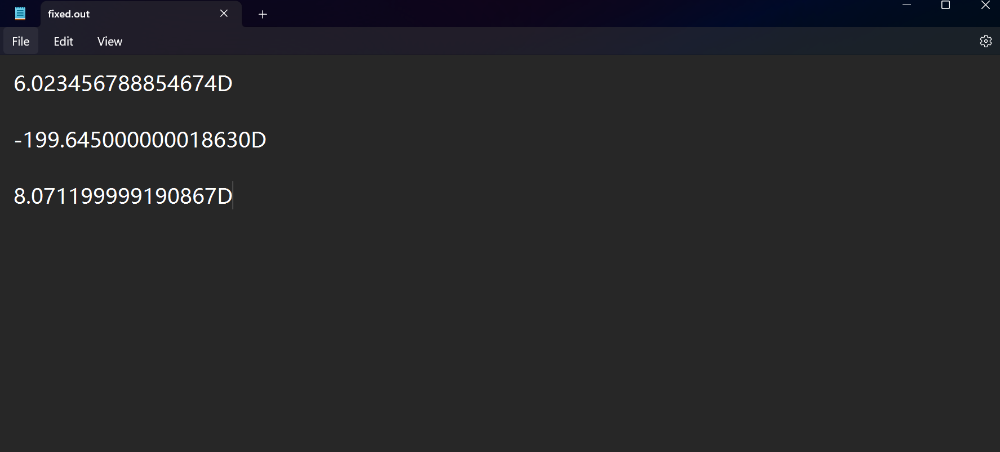

# CS-MEDIUM-02 定点数精确运算

## 课前准备--文件操作

读取 `CS_M_02.in` 中的数字，全部转为十进制，并输出于 `CS_M_02.out` 文件。

```C
#include<stdio.h>
#include<string.h>
#include<math.h>
#define maxn 110000
char s[maxn];
double num=0.0;
double to_dec(char s[],int len)
{
    double ans=0.0;
    int pos=len;
    for(int i=0;i<=len-1;++i)
        if(s[i]=='.')
        {
            pos=i;
            break;
        }
    for(int i=pos-1;i>=0;--i)
    {
        if(s[i]=='1')
        {
            ans+=pow(2,pos-1-i);
        }
    }
    for(int i=pos+1;i<=len-1;++i)
    {
        if(s[i]=='1')
        {
            ans+=pow(2,-(i-pos));
        }
    }
    return ans;
}

int main()
{
    freopen("CS_M_02.in","r",stdin);
    freopen("CS_M_02.out","w",stdout);
    int n=15;
    while(n--)
    {
        scanf("%s",s);
        int l=strlen(s);
        if(s[l-1]=='B')
        {

            num=to_dec(s,l-1);

        }
        else if(s[l-1]=='D')
        {
            s[l-1]='E';
            sscanf(s,"%lf",&num);
        }
        printf("%g\n",num);
        memset(s,0,sizeof(s));
        num=0.0;
    }

    return 0;
}

```


## 任务1

### Q1.为什么会出现这样的现象？

在计算机中，浮点数也是由二进制表示的，但是十进制的浮点数在转为二进制时，根据十进制转二进制的算法，可能会产生**无限**的二进制位数，也就是说，有限的存储空间**无法精确表示**二进制的浮点数，不仅如此，在计算过程中同样会产生舍入的误差，因此浮点数在运算时可能会产生精度丢失的误差。


### Q2.该如何获得精确值呢？

C语言 gmp 库中定义了 `mpf_t` 等用于存储大浮点数的变量，以及用于进行运算的 `mpf_add` `mpf_sub` `mpf_mul` `mpf_div` 等函数，用这些方法可以实现精度非常高的浮点数运算。


### Q3.课前热身：请**提交代码**实现二进制与十进制的相互转化

见 `source_code` 文件夹中的 进制改写 代码 ，同样读取 `CS_M_02.in` 中的数字，并互转进制后输出为 `CS_M_02_2.out` 文件。


## 任务2

真的想不到正解了，这是应该是一个接近正解的做法了，数值上是肯定是没错的，但是到小数点十位之后会丢精。


输入：

5.223456789114514D + 0.8D

114.514D - 314.159D

1.14D * 7.08D


正解输出

6.023456789114514D

-199.645D

8.0712D


我的输出：




### Code:

```c
#include<stdio.h>
#include<string.h>
#include<math.h>
#include<stdint.h>
#define maxn 110000
#define int int32_t
#define uint uint32_t
#define ull uint64_t
typedef struct {
    int intgr;
    uint frac;
}PointFixedNum;
PointFixedNum a,b,ans;
const ull scale=(1ULL<<32);
char s1[maxn],s2[maxn],op;
double num1=0.0,num2=0.0;
void init(PointFixedNum *a,double num)
{
    a->intgr=(int)num;
    a->frac=(uint)((num-a->intgr)*scale);
}
void clear()
{
    a.frac=b.frac=ans.frac=0;
    a.frac=b.frac=ans.frac=0;
    num1=0.0;
    num2=0.0;
}
void read()
{
    scanf(" %1100[^ ]",s1);
    scanf(" %c",&op);
    scanf("%1100s",s2);
    int len1=strlen(s1),len2=strlen(s2);
    s1[len1-1]='E';
    s2[len2-1]='E';
    sscanf(s1,"%lf",&num1);
    sscanf(s2,"%lf",&num2);
}
PointFixedNum add(PointFixedNum a,PointFixedNum b)
{
    PointFixedNum c;
    ull sum=(ull)a.frac+b.frac;
    c.frac=(uint)(sum%scale);
    c.intgr=a.intgr+b.intgr+(int)(sum/scale);
    return c;
}
PointFixedNum sub(PointFixedNum a,PointFixedNum b)
{
    PointFixedNum c;
    ull diff=(ull)a.frac-b.frac;
    c.frac=(uint)(diff%scale);
    c.intgr=a.intgr-b.intgr-(int)(diff/scale);
    return c;
}
PointFixedNum mul(PointFixedNum a,PointFixedNum b)
{
    PointFixedNum c={0,0};
    ull pro1=(ull)a.intgr*b.intgr;
    ull pro2=(ull)a.intgr*b.frac;
    ull pro3=(ull)a.frac*b.intgr;
    ull pro4=(ull)a.frac*b.frac;

    ull carry=pro4%scale>=scale/2;

    ull sum=pro4/scale+pro3%scale+pro2%scale+carry;
    c.frac=sum%scale;
    carry=sum/scale;

    sum=pro1%scale+pro2/scale+pro3/scale+carry;
    c.intgr=sum%scale;

    return c;
}
void print(PointFixedNum a)
{
    double fraction=(double)a.frac/scale;
    double fin=(double)a.intgr+fraction;
    printf("%.15lf",fin);
}
int main()
{
    read();
    init(&a,num1);
    init(&b,num2);
    if(op=='+')
    {
        ans=add(a,b);
    }
    else if(op=='-')
    {
        ans=sub(a,b);
    }
    else if(op=='*')
    {
        ans=mul(a,b);
    }
    print(ans);
    putchar('D');
    return 0;
}

```


我还是太菜了喵(╥ᆺ╥；)
